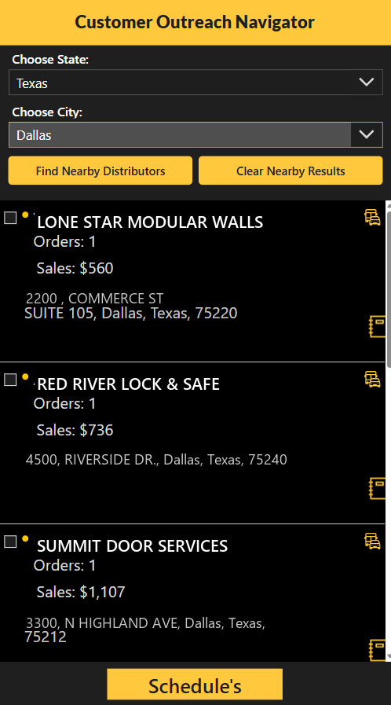
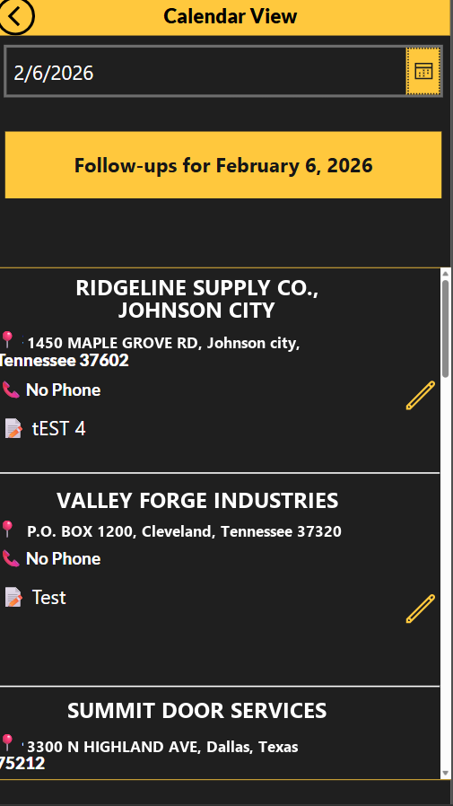

# Customer Outreach Navigator

A Power Apps Canvas app that helps field sales reps find nearby distributors, review each account's sales history, log follow-up activity, and work a follow-up calendar — all from a phone or tablet.

> **Client engagement.** Built as a production solution for a client in the commercial door & hardware manufacturing industry. Company names, addresses, and account details shown in the screenshots have been replaced with fictional equivalents to protect client confidentiality.

## Overview

Sales reps needed a fast way to answer one question while on the road: *"Who's near me that I should be talking to?"* This app lets a rep pick a state and city, pull back nearby distributors within a radius, and immediately see whether each one is an active, low, or untapped account — then log the next follow-up.

## Key Features

- **Location-based discovery** — choose state + city, find nearby distributors within a configurable radius.
- **Account context at a glance** — order count, total sales, and full address per distributor.
- **Follow-up logging** — record interaction type, status, notes, and the next follow-up date against any account.
- **Follow-up calendar** — a date-driven view of every account due for follow-up on a given day.
- **Cached discovery layer** — nearby-distributor results are cached in SQL and refreshed on a schedule by a Power Automate flow, so the app stays fast and avoids hitting the external places API on every open.
- **Low-sales targeting** — a SQL view tiers customers by sales (NTILE) and surfaces the lowest tier, so reps prioritise under-served accounts.

## Tech Stack

- **Power Apps** (Canvas app, phone/tablet layout)
- **SQL Server** data warehouse (cache table, notes table, reporting views)
- **Power Automate** (scheduled cache refresh from a maps/places API)

## Screenshots

| Distributor discovery | Follow-up calendar |
|---|---|
|  |  |

## Data Model

See [`sql/`](sql/) for the backing objects:

- `01-distributor-cache.sql` — cached nearby-distributor results, refreshed by Power Automate.
- `02-distributor-notes.sql` — follow-up interactions logged by reps.
- `03-sales-summary-views.sql` — `vw_CustomerSalesSummary` (sales + order count per customer) and `vw_LowSalesCustomers` (lowest sales tier).

---

*Screenshots use anonymized sample data. The database name (`ClientDW`) is a placeholder.*
